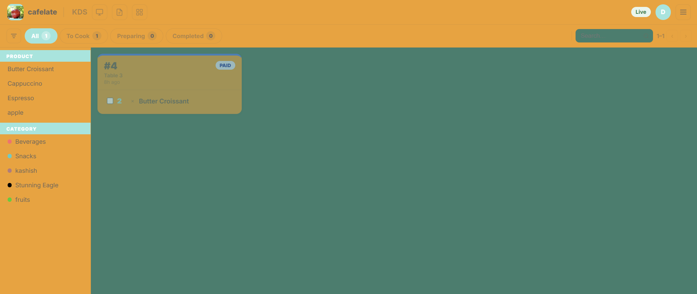
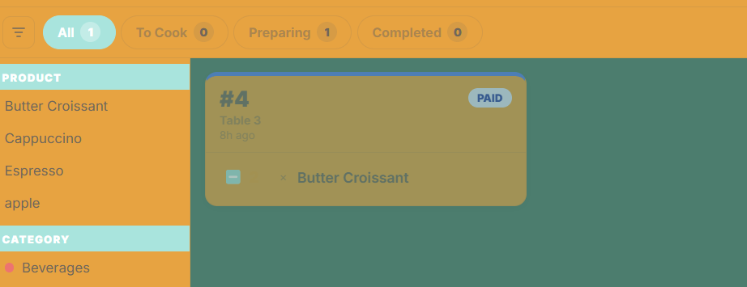
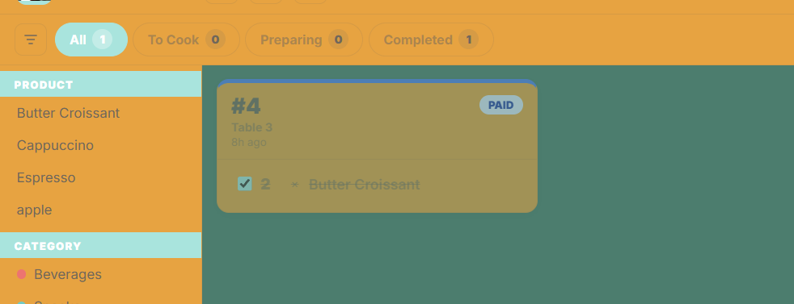
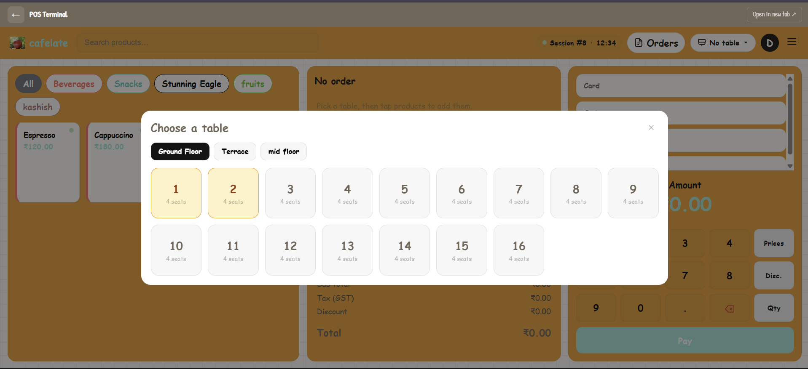
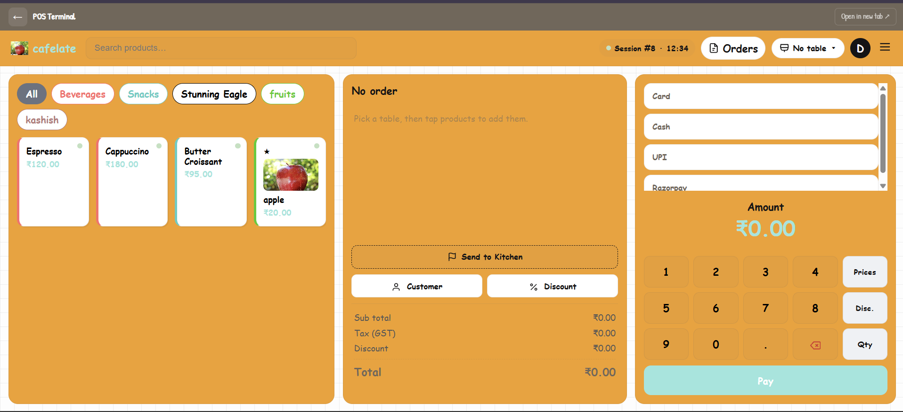
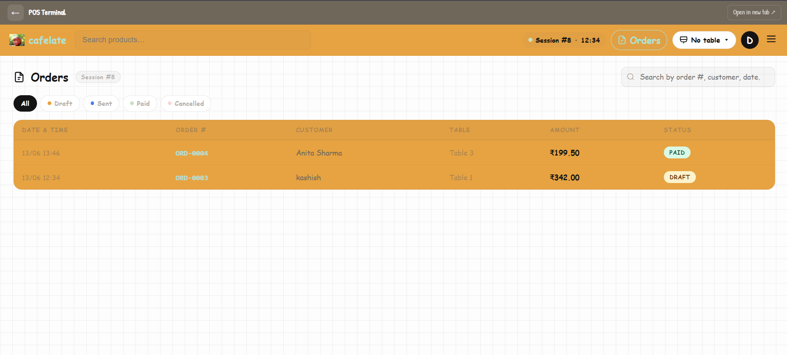
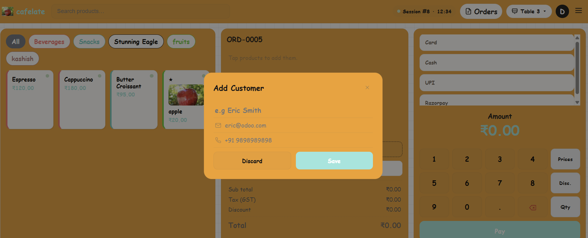
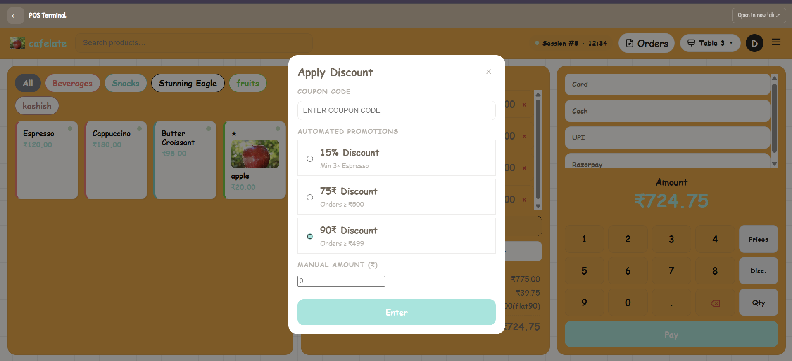

# KUBA — Multi-Tenant Cafe POS Platform

> A full-stack, multi-tenant Point of Sale system built for modern cafes. Each cafe gets its own isolated subdomain workspace with a complete POS terminal, live Kitchen Display System, AI assistant, loyalty programs, smart feedback collection, and more — all managed from a central super-admin panel.

---
Deployed on : [this link](kashishshrivastav.in)

Video is available on : [this link](https://drive.google.com/file/d/1iAor_smt0eA2am9pCNaYqT42IcAdH6Hn/view?usp=drive_link)

## Table of Contents

- [Architecture Overview](#architecture-overview)
- [Multi-Tenant Subdomain System](#multi-tenant-subdomain-system)
- [Quick Start](#quick-start)
- [Tech Stack](#tech-stack)
- [Super Admin Panel](#super-admin-panel)
- [Cafe Admin Dashboard](#cafe-admin-dashboard)
- [POS Terminal](#pos-terminal)
- [Kitchen Display System (KDS)](#kitchen-display-system-kds)
- [AI Chat Assistant](#ai-chat-assistant)
- [Feedback & Reports](#feedback--reports)
- [Project Structure](#project-structure)
- [Environment Variables](#environment-variables)
- [Feature Walkthrough Videos](#feature-walkthrough-videos)
- [Screenshots](#screenshots)

---

## Architecture Overview

KUBA uses a **single-database, subdomain-based multi-tenancy** model. All cafes share the same database and codebase, but are logically isolated by their subdomain. Every request is intercepted by `TenantMiddleware`, which resolves the cafe from the hostname and injects it into the request context.

```
+-----------------------------------------------------+
|                KUBA Platform                        |
|                                                     |
|  admin.kuba.com  ->  Django Super Admin (Jazzmin)   |
|  kuba.com        ->  Public Landing Page            |
|                                                     |
|  blue-bottle.kuba.com  -+                           |
|  roastery.kuba.com      +-->  Per-Cafe Workspace    |
|  mylocal.kuba.com      -+     (same codebase)       |
+-----------------------------------------------------+
```

```
Request Lifecycle:
  HTTP Request -> TenantMiddleware resolves Cafe from HOST header
               -> Injects cafe into request.cafe
               -> All views/querysets filter by request.cafe
```

---

## Multi-Tenant Subdomain System

### How it Works

Each cafe is registered with a **unique subdomain** (e.g. `mycafe.kuba.com`). Django reads the `Host` header on every request and the `TenantMiddleware` looks up the corresponding `Cafe` object.

```python
# tenants/middleware.py
class TenantMiddleware:
    def __call__(self, request):
        subdomain = extract_subdomain(request.get_host())
        request.cafe = Cafe.objects.get(subdomain=subdomain)
        return self.get_response(request)
```

### The `Cafe` Model

```python
class Cafe(models.Model):
    name          = models.CharField(max_length=100)
    subdomain     = models.SlugField(unique=True)          # e.g. "blue-bottle"
    custom_domain = models.CharField(blank=True)           # e.g. "pos.mybrand.com"
    owner         = models.ForeignKey(User, ...)
    is_active     = models.BooleanField(default=True)
    slug          = models.SlugField(auto-generated)
    created_at    = models.DateTimeField(auto_now_add=True)
```

### URL Routing

| Host Pattern | Destination |
|---|---|
| `kuba.com` | Public landing page |
| `admin.kuba.com` | Django super-admin panel |
| `*.kuba.com` | Cafe-specific workspace |
| Custom domains | Resolved via `custom_domain` field |

### Local Development

Add wildcard subdomains to your `/etc/hosts`:
```
127.0.0.1  localhost
127.0.0.1  admin.localhost
127.0.0.1  mycafe.localhost
```

Then run the server and access your cafe at `http://mycafe.localhost:8000/`.

### Reserved Subdomains

The `ReservedSubdomain` model blocks cafes from registering sensitive slugs like `admin`, `api`, `www`, `static`, etc. Managed from the Super Admin panel.

---

## Quick Start

```bash
# 1. Clone the repository
git clone <repo-url>
cd Kuba

# 2. Create and activate a virtual environment
python -m venv venv
venv\Scripts\activate      # Windows
# source venv/bin/activate  # Linux/macOS

# 3. Install dependencies
pip install -r requirements.txt

# 4. Configure environment variables
cp .env.example .env
# Edit .env with your settings (see Environment Variables below)

# 5. Run migrations
python manage.py migrate

# 6. Create a superuser
python manage.py createsuperuser

# 7. Start the development server (ASGI via Daphne for WebSocket support)
daphne kuba.asgi:application

# 8. (Optional) Start with Django's built-in server
python manage.py runserver
```

> **Note:** For real-time WebSocket features (Live KDS, Live POS updates), use `daphne` or run with ASGI.

---

## Tech Stack

| Layer | Technology |
|---|---|
| **Framework** | Django 5.x |
| **Async / WebSockets** | Django Channels + Daphne (ASGI) |
| **Auth** | django-allauth (email-based login, custom adapters) |
| **Admin UI** | django-jazzmin |
| **Database** | SQLite (dev) / PostgreSQL (prod) |
| **Real-time** | In-Memory Channel Layer (dev) / Redis (prod) |
| **Payments** | Razorpay integration |
| **QR Codes** | `qrcode` library |
| **Images** | Pillow |
| **Email** | SMTP (configurable per cafe) |

---

## Super Admin Panel

> **URL:** `http://admin.localhost:8000/admin/`
> **Access:** Django superusers only. Enforced by `AdminAccessMiddleware`.

The super admin panel (powered by **Jazzmin**) provides complete platform-level control.

### Cafes & Platform

#### Cafes (`tenants.Cafe`)
Manage all registered cafe instances across the platform.

| Action | Description |
|---|---|
| **View / Edit** | Change name, subdomain, custom domain, owner, active status |
| **Activate cafes** | Bulk-activate selected cafes |
| **Deactivate cafes** | Bulk-deactivate to suspend access |
| **Email credentials to owner** | Generates a new random password, updates the DB, and emails the owner their URL, username, email, and new password |

**Key fields visible in admin:**
- `name`, `subdomain`, `custom_domain`, `owner`, `is_active`, `created_at`
- Inline subdomain availability checker (JavaScript widget)
- Read-only `slug` and `primary_url_display` for quick reference

#### Reserved Subdomains (`tenants.ReservedSubdomain`)
Block specific slugs from being registered by cafe owners.

```
Examples: admin, api, www, static, media, mail, dashboard
```

#### Audit Logs (`tenants.AuditLog`)
A tamper-evident, append-only log of all significant actions taken within any cafe workspace.

Each log entry captures:
- `cafe` — which cafe it happened in
- `user` — who performed the action
- `action` — what happened (e.g. `ORDER_CREATED`, `TABLE_UNLOCKED`)
- `timestamp` — when it occurred
- `extra` — JSON payload of relevant context

> Audit logs are **read-only** in the admin panel by design.

### Cafe POS App

#### Chat Assistant Settings (`cafe_pos.ChatAssistantSettings`)
Configure the AI assistant per cafe: system prompt, model, and behavior.

#### Chat Sessions (`cafe_pos.ChatSession`)
View all AI chat sessions across the platform. Useful for debugging or monitoring usage.

### Authentication & Authorization

Standard Django auth management:
- **Groups** — assign permission sets to staff roles
- **Users** — manage all user accounts, reset passwords, toggle superuser/staff flags

---

## Cafe Admin Dashboard

> **URL:** `http://<subdomain>.localhost:8000/`
> **Access:** Cafe owner or staff with appropriate role

### Main Dashboard
- Real-time revenue metrics for today
- Top-selling products by quantity and revenue
- Order count and average ticket value
- Recent order feed

### Catalog Management

#### Products
- Add / edit / archive menu items
- Upload product images (served via Django media)
- Set price, tax percentage, unit of measure
- Toggle `is_active`, `show_in_kds`
- Mark as `is_featured` with a visual badge
- Apply custom tags (e.g. `Chef's Special`, `Vegan`, `New`)
- Set cross-sell recommendations (M2M self-relation)

#### Categories
- Group products for fast POS navigation
- Drag-to-reorder (display order)

### Daily Operations

#### Floor & Tables
- **Interactive visual canvas** — drag-and-drop table placement on a grid
- Real-time status: `Free`, `Occupied`, `Reserved`
- Force-unlock any table from the admin (bypasses all locks)
- Assign orders to specific tables
- Custom table shapes via freehand sketch mode

#### Payment Methods
- Enable/disable: **Cash**, **Card**, **UPI QR**, **Custom**
- Configure Razorpay credentials per cafe

#### Coupons & Promotions
- Fixed amount or percentage discounts
- Time-limited (start/end datetime) or unlimited
- Apply at checkout from POS dropdown

#### Loyalty
- Customer profiles with visit history
- Point accrual per order
- Redeem points at POS checkout

#### Receipts
- Upload cafe logo
- Custom header/footer text
- Feedback QR code embedded at bottom
- Email receipts to customer

### Management & Security

#### Users & Employees
- Invite staff with predefined roles: `Cashier`, `Manager`, `Kitchen`
- Role-based access control enforced at view level

#### Customize Cafe
- Update cafe name, logo, brand colors
- Configure subdomain or custom domain

#### Audit Log
- Read-only view of all actions in this cafe
- Filter by user, action type, or date range

### Reports

- Daily / weekly / monthly revenue charts
- Product performance breakdown
- Order volume by hour (heatmap)

---

## POS Terminal

> **URL:** `http://<subdomain>.localhost:8000/pos/`
> **Access:** Cashier role and above

The POS terminal is a **single-page, real-time interface** optimized for speed.

### Key Features

| Feature | Description |
|---|---|
| **Product Grid** | Tap-to-add with category filter tabs |
| **Cross-sells** | AI-suggested "You may also like" items shown when a product is added |
| **Order Cart** | Running total with tax breakdown, coupon application |
| **Customer Lookup** | Search by name or phone, attach to order for loyalty |
| **Table Assignment** | Select from live floor map |
| **Payment** | Cash / Card / UPI with receipt generation |
| **Feedback Email** | Resend feedback request to customer from receipt screen |
| **Table Unlock** | Admin can force-unlock any table from the POS if needed |

### Real-time Sync

The POS uses **Django Channels (WebSocket)** to push order status changes to the Kitchen Display System without page reload.

```
POS creates order -> WebSocket message -> KDS receives update instantly
```

---

## Kitchen Display System (KDS)

> **URL:** `http://<subdomain>.localhost:8000/kds/`
> **Access:** Kitchen staff role

A full-screen, real-time order board designed for kitchen screens.

### Order States

```
New (orange) -> Cooking (blue) -> Ready (green) -> Completed
```

### Features
- Orders appear **instantly** via WebSocket push from POS
- Color-coded urgency for long-pending orders
- Tap any item to toggle its state
- Works on any tablet, monitor, or TV
- No page refresh required — fully live

**See it in action:**
- [KDS Home View](stock/kds/home.png)
- [Orders in Process](stock/kds/process.png)
- [Completed Orders](stock/kds/completed.png)

---

## AI Chat Assistant

> **URL:** `http://<subdomain>.localhost:8000/chatbot/`

An embedded AI-powered chatbot that knows your live menu.

### How It Works

1. On each session, `scrape_menu_data()` builds a JSON snapshot of the cafe's current products (name, price, description, tags, featured status).
2. The AI system prompt receives this snapshot as context.
3. When the AI mentions a product using `[PRODUCT:id]` syntax, the backend fetches the product and returns a **rich product card** (with image) to the frontend.
4. Cards are rendered as interactive bubbles in the chat UI.

### Configuration (per cafe)

Configured via `ChatAssistantSettings` in the admin:
- `system_prompt` — custom personality and instructions
- `model` — which LLM to use
- Active/inactive toggle

---

## Feedback & Reports

### Feedback Collection

- Automatically triggered after order completion
- Email sent to customer with a star-rating form link
- Staff can **resend** the feedback email from the POS receipt screen
- The feedback form URL is unique per order (uses signed tokens)

### Feedback Model

```python
class Feedback(models.Model):
    cafe          = ForeignKey(Cafe)
    order         = ForeignKey(Order)
    customer      = ForeignKey(Customer)
    rating        = IntegerField(1-5)
    comment       = TextField(blank=True)
    cashier       = ForeignKey(User)
    kitchen_staff = ForeignKey(User)
    created_at    = DateTimeField(auto_now_add=True)
```

### Feedback Report Dashboard

- Live feed of all ratings with comments
- Average rating over time (chart)
- Per-staff performance linked to customer satisfaction

---

## Project Structure

```
Kuba/
+-- kuba/                    # Django project config
|   +-- settings.py          # Main settings (multi-tenant, channels, email)
|   +-- urls.py              # Root URL conf
|   +-- asgi.py              # ASGI + Channels routing
|   +-- wsgi.py
|
+-- tenants/                 # Multi-tenancy core app
|   +-- models.py            # Cafe, ReservedSubdomain, AuditLog
|   +-- middleware.py        # TenantMiddleware, AdminAccessMiddleware
|   +-- adapters.py          # django-allauth custom adapter
|   +-- forms.py             # CafeSignupForm, CafeLoginForm
|   +-- admin.py             # CafeAdmin with email-credentials action
|   +-- context_processors.py
|
+-- cafe_pos/                # Core POS models & logic
|   +-- models.py            # Product, Category, Order, OrderLine, Customer...
|   +-- chatbot.py           # AI assistant logic, scrape_menu_data()
|   +-- consumers.py         # WebSocket consumers for KDS
|
+-- dashboard/               # Cafe admin dashboard
|   +-- views.py             # All dashboard views (home, products, feedback...)
|   +-- forms.py             # ProductForm, CouponForm, etc.
|   +-- urls.py
|
+-- pos/                     # POS terminal app
|   +-- views.py
|   +-- urls.py
|
+-- templates/               # All HTML templates
|   +-- landing.html         # Public landing page
|   +-- account/             # Login, signup, password reset
|   +-- dashboard/           # Cafe admin templates
|   +-- pos/                 # POS terminal + KDS
|   +-- chatbot/             # AI chat session
|
+-- static/                  # CSS, JS, images
|   +-- css/
|   +-- js/
|   +-- img/
|
+-- stock/                   # Demo videos & screenshots (landing page assets)
|   +-- product-section.mp4
|   +-- floor-table-config.mp4
|   +-- kds/
|   |   +-- home.png
|   |   +-- process.png
|   |   +-- completed.png
|   +-- poc/
|       +-- front.png
|       +-- home.png
|       +-- ...
|
+-- requirements.txt
```

---

## Environment Variables

Create a `.env` file in the `Kuba/` directory:

```env
# -- Security --------------------------------------------------
SECRET_KEY=your-django-secret-key-here

# -- Multi-Tenancy ---------------------------------------------
KUBA_BASE_DOMAIN=kuba.com          # Production base domain
KUBA_ADMIN_SUBDOMAIN=admin         # Superadmin subdomain prefix

# -- Email (SMTP) ----------------------------------------------
EMAIL_HOST=smtp.gmail.com
EMAIL_PORT=587
EMAIL_USE_TLS=True
EMAIL_HOST_USER=your@gmail.com
EMAIL_HOST_PASSWORD=your-app-password
DEFAULT_FROM_EMAIL=KUBA <your@gmail.com>
APP_NAME=KUBA

# -- Payments --------------------------------------------------
RAZORPAY_KEY_ID=rzp_test_xxxx
RAZORPAY_KEY_SECRET=xxxx
```

> If `EMAIL_HOST_USER` is empty, Django falls back to `console.EmailBackend` (prints emails to terminal — perfect for development).

---

## Feature Walkthrough Videos

Click any link below to view the recorded demo video for that feature:

| Feature | Video |
|---|---|
| Products & Menu Management | [product-section.mp4](stock/product-section.mp4) |
| Floor & Tables Canvas | [floor-table-config.mp4](stock/floor-table-config.mp4) |
| Coupons & Promotions | [cupons-promo-cofig.mp4](stock/cupons-promo-cofig.mp4) |
| Payment Methods | [payment_config.mp4](stock/payment_config.mp4) |
| Loyalty Program | [loyality-cofnfig.mp4](stock/loyality-cofnfig.mp4) |
| Receipts Customization | [receipts_config.mp4](stock/receipts_config.mp4) |
| Feedback Configuration | [feedback-config.mp4](stock/feedback-config.mp4) |
| AI Assistant | [ai-assist-config.mp4](stock/ai-assist-config.mp4) |
| Customize Your Cafe | [customize_your_cafe.mp4](stock/customize_your_cafe.mp4) |

---

## Screenshots

### Kitchen Display System (KDS)

| Screen | Preview |
|---|---|
| KDS Home — Live Orders |  |
| Orders in Process |  |
| Completed Orders |  |

### POS Terminal

| Screen | Preview |
|---|---|
| POS Front View |  |
| Dashboard Home |  |
| Active Orders |  |
| Add Customer |  |
| Coupons at Checkout |  |
| Table Lock Status |  |
| Feedback Email from POS |  |
| Customer Profile Popup |  |

---

## Deployment Notes

- Switch `Channel Layer` from `InMemoryChannelLayer` to **Redis** for production WebSocket support.
- Set `DEBUG=False` and configure `ALLOWED_HOSTS` with your real domain.
- Use **nginx** as a reverse proxy with wildcard SSL (`*.kuba.com`) for subdomain routing.
- Point the Django `STATIC_ROOT` and run `collectstatic` before serving.
- Use `gunicorn` + `uvicorn` workers or `daphne` behind nginx for ASGI.

```nginx
server {
    listen 443 ssl;
    server_name *.kuba.com kuba.com;

    ssl_certificate     /etc/ssl/kuba.com/fullchain.pem;
    ssl_certificate_key /etc/ssl/kuba.com/privkey.pem;

    location / {
        proxy_pass http://127.0.0.1:8000;
        proxy_set_header Host $host;
        proxy_set_header X-Real-IP $remote_addr;
    }

    location /ws/ {
        proxy_pass http://127.0.0.1:8000;
        proxy_http_version 1.1;
        proxy_set_header Upgrade $http_upgrade;
        proxy_set_header Connection "upgrade";
    }
}
```

---

## License

Built by the KUBA team. All rights reserved.
